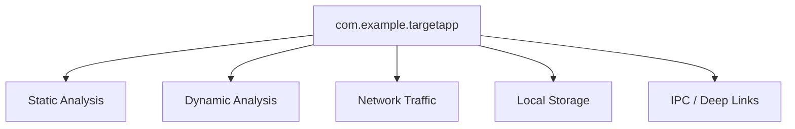

# Attack Surface Mindmap: com.example.targetapp

```mermaid
graph TD
  Root[com.example.targetapp] --> Static[Static Analysis]
  Root --> Dynamic[Dynamic Analysis]
  Root --> Network[Network Traffic]
  Root --> Storage[Local Storage]
  Root --> IPC[IPC / Deep Links]
```
